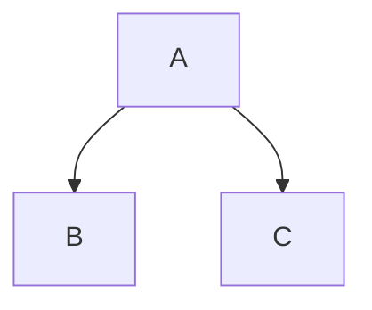

{: .label }
[Dzhan Nezhdet]

{: .attention}
> Once you are familiar with the available UI components of this template, exclude this page by changing `nav_order: 99` to `nav_exclude: true` on top of this page (line 3). Its *front matter* will then look like this:
> ```
> ---
> title: UI Components
> ---
> ```

# UI components

The [Just the Docs documentation](https://just-the-docs.github.io/just-the-docs/docs/ui-components) details more UI components.

For a quick reference of the markdown syntax, visit [this page](https://github.com/just-the-docs/just-the-docs/blob/main/docs/index-test.md?plain=1).

## Images

### Sign in Screen


### Sign up - Name


### Sign up - Uni


### Sign up - Course of study


### Sign up - Semester


### Sign up - Skills & interests


### Sign up Uni - E-Mail


### Sign up - Password


### Loading Screen


### Homescreen


### Homescreen - Filters


### Profile Screen


### Search Screen


### Match Screen


### Messages Screen


## Callouts

{: .info }
> This is an info callout.

{: .tip }
> This is a tip callout.

{: .attention }
> This is an attention callout.

> {: .download }
> This is a download callout.

## Labels

{: .label }
[Default label]

{: .label .label-green }
[Green label]

{: .label .label-red }
[Red label]

## Mermaid.js



Visit the [Mermaid docs](https://mermaid.js.org/intro/) for a thorough description of the charting possibilities.